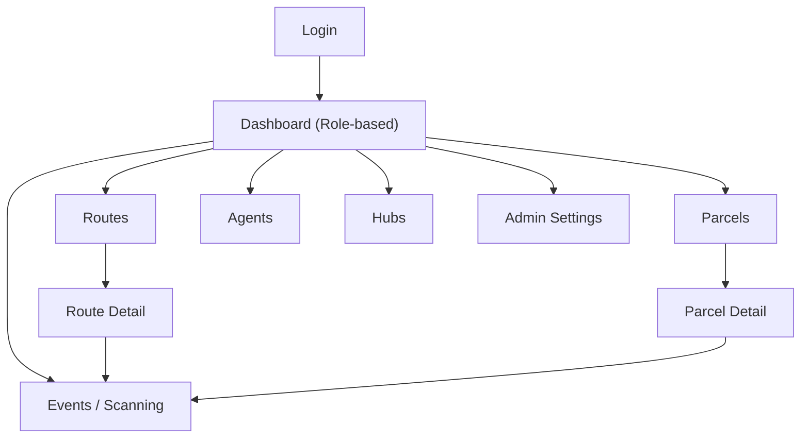

## 1. Product Overview
HubRoute MVP is a web system to manage parcel delivery operations across hubs, routes, and field agents.
It tracks parcel lifecycle events end-to-end and provides role-based dashboards for day-to-day execution and oversight.

## 2. Core Features

### 2.1 User Roles
| Role | Registration Method | Core Permissions |
|------|---------------------|------------------|
| Customer | Admin-created account (MVP) | Create shipments, view parcel status, view delivery history/events |
| Hub Staff | Admin-created account (MVP) | Create/assign routes, intake/scan parcels, dispatch/receive, record hub events |
| Agent | Admin-created account (MVP) | View assigned route stops, update parcel statuses, capture delivery attempts and proof notes |
| Admin | Admin-created account | Manage hubs/routes/agents/users, correct data, view system-wide dashboards and audit trail |
| Public (unauthenticated) | N/A | Track parcel by tracking code; view parcel hub-path + status timeline with redacted PII |

### 2.2 Feature Module
Our HubRoute MVP requirements consist of the following main pages:
1. **Login**: sign in, session management, role-based redirect.
2. **Dashboard (role-based)**: KPI tiles, work queues, quick actions.
3. **Parcels**: create parcel (customer/hub), parcel list/search, parcel details with timeline of events.
4. **Routes**: create route, assign agent, route stop list, dispatch/close route.
5. **Agents**: agent directory (admin/hub), agent detail with assigned routes and performance basics.
6. **Hubs**: hub directory (admin), hub detail with active routes and inbound/outbound parcel queues.
7. **Events / Scanning**: fast event capture (hub/agent), event history and corrections (admin).
8. **Admin Settings**: user management, reference data (statuses/event types), audit review.
9. **Public Tracking**: unauthenticated parcel tracking page by tracking code.

### 2.3 Page Details
| Page Name | Module Name | Feature description |
|-----------|-------------|---------------------|
| Login | Authentication | Authenticate by email + password; create server session; redirect to role dashboard. |
| Dashboard (Customer) | My Shipments | List customer parcels; filter by status; open parcel details. |
| Dashboard (Customer) | Create Shipment | Create a parcel with sender/recipient, address, service level, optional notes. |
| Dashboard (Hub) | Hub Work Queues | Show inbound, ready-to-route, exceptions; quick links to scan/event capture. |
| Dashboard (Hub) | Route Operations | Create route; assign agent; dispatch/close; show active routes. |
| Dashboard (Agent) | Today’s Route | Show assigned route(s); stop sequence; parcel list per stop; open parcel update. |
| Dashboard (Admin) | System Overview | Show totals by hub/status; recent events; exceptions needing review. |
| Parcels | Parcel Search/List | Search by tracking code/recipient/phone; filter by status/hub/date; open details. |
| Parcels | Parcel Detail | View parcel master data; view full event timeline; show current status and current hub/agent assignment. |
| Parcel Detail | Hub Path | Show ordered hub chain (pickup hub → any transit hubs → warehouse → last-mile hub → delivered). Derived from hub scan events/hops. |
| Parcels | Edit (limited) | Allow admin to correct key fields and add correction note; record correction event. |
| Routes | Route List | List routes by hub/date/status; open route detail. |
| Routes | Route Detail | View assigned agent; list stops/parcels; dispatch route; close route; show route event history. |
| Routes | Assignment | Assign/unassign parcels to route; reorder stops (MVP: manual order). |
| Agents | Agent List | List agents; status (active/inactive); open agent detail. |
| Agents | Agent Detail | View assigned routes; basic counts (delivered/failed); set active/inactive (admin). |
| Hubs | Hub List | List hubs; open hub detail. |
| Hubs | Hub Detail | View inbound/outbound queues; active routes; recent hub events. |
| Events / Scanning | Capture Event | Create an event for a parcel (scan/enter tracking); choose event type; capture location/time/notes; apply business rules to update parcel status. |
| Events / Scanning | Event History | List events by parcel/route/hub/agent/date; open event detail. |
| Admin Settings | Users & Roles | Create/edit/disable users; assign role; reset password. |
| Admin Settings | Reference Data | Manage event types and allowed status transitions (MVP: minimal fixed set). |
| Admin Settings | Audit & Corrections | Review correction events; export basic CSV (optional MVP: admin-only download). |
| Public Tracking | Track by Code | /track?code=... shows current status + latest hub + timeline; addresses are redacted by default. |

## 3. Core Process
Customer Flow:
- Sign in → create a parcel (shipment) → receive tracking code → monitor parcel status via parcel detail timeline.

Public Tracking Flow:
- Open /track → enter tracking code → see current parcel status and the hub chain it has passed through (hub names + timestamps), plus a basic event timeline.

Hub Staff Flow:
- Sign in → view hub queues → intake parcels (create “Received at Hub” events) → create route → assign agent and parcels → dispatch route → receive returns/exceptions → close route.

Multi-hub Movement (chain-of-custody):
- A parcel may pass through multiple named hubs before reaching the recipient (e.g., pickup hub → cross-dock hub → central warehouse → last-mile hub).
- Each hub touchpoint is captured as an event (arrived/departed/received) and becomes part of the parcel “hub path” shown to hubs/agents/customers (and to the public tracking page with PII redaction).

Agent Flow:
- Sign in → open assigned route → for each stop/parcel, record delivery events (out for delivery, delivered, failed attempt, returned) → add notes for exceptions → finish route.

Admin Flow:
- Sign in → monitor overall dashboards → manage hubs/routes/agents/users → correct data (with audit events) → review exceptions.

