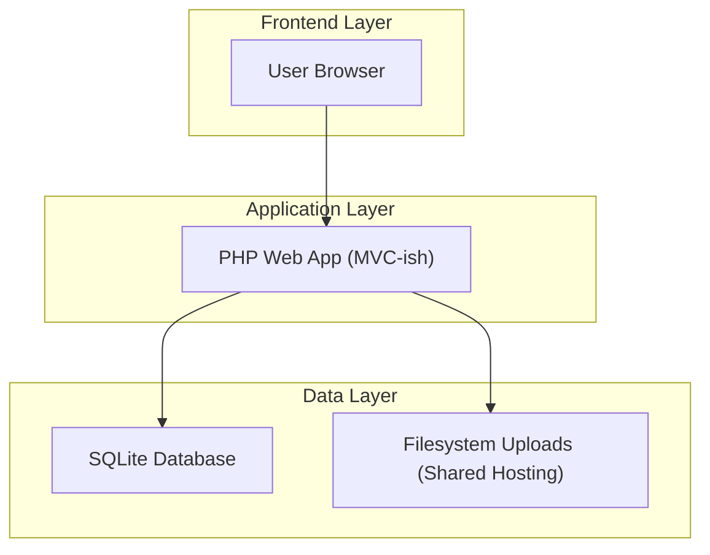
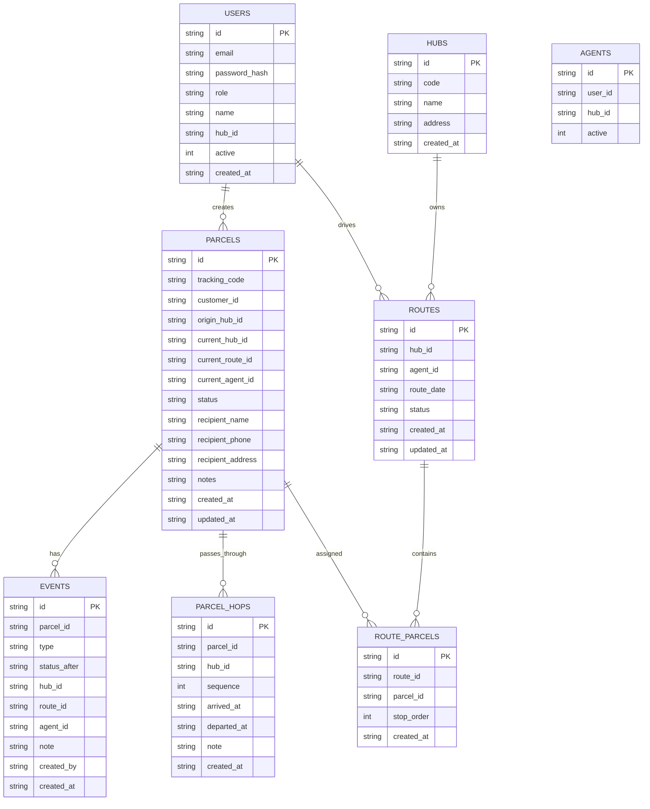

## 1.Architecture design


## 2.Technology Description
- Frontend: Server-rendered HTML (PHP templates) + minimal vanilla JS (optional for scan UI) + CSS
- Backend: PHP 8.x (no long-running processes assumed)
- Database: SQLite (single file DB)

Deployment assumptions (shared hosting PHP + SQLite):
- App served via Apache/Nginx with PHP-FPM (or mod_php); no Docker required.
- Single writable directory for SQLite file and uploads (e.g., /data) with correct permissions.
- HTTPS enabled at hosting level; environment config via .env (or config.php) outside web root.
- Cron available (optional) for housekeeping: closing stale routes, cleaning sessions, generating daily summaries.

## 3.Route definitions
| Route | Purpose |
|-------|---------|
| /login | Sign in |
| /logout | End session |
| /dashboard | Role-based dashboard |
| /parcels | Parcel list/search |
| /parcels/new | Create parcel |
| /parcels/{id} | Parcel detail (timeline) |
| /track | Public tracking (enter tracking code) |
| /track/{tracking_code} | Public tracking detail (no login) |
| /routes | Route list |
| /routes/new | Create route |
| /routes/{id} | Route detail (stops/parcels, dispatch/close) |
| /agents | Agent list |
| /agents/{id} | Agent detail |
| /hubs | Hub list (admin) |
| /hubs/{id} | Hub detail |
| /events | Event history/search |
| /scan | Fast event capture UI |
| /admin/users | User management |
| /admin/reference | Reference data (event types/status rules) |
| /admin/audit | Corrections/audit review |

## 4.API definitions (If it includes backend services)
The MVP can be fully server-rendered. If you want a minimal JSON API (recommended for fast scanning + route mobile view), expose these endpoints under /api and protect them by session cookie.

### 4.1 Core API
Authentication
- POST /api/auth/login
- POST /api/auth/logout
- GET /api/me

Parcels
- POST /api/parcels
- GET /api/parcels?query=&status=&hub_id=&date_from=&date_to=
- GET /api/parcels/{id}

Public tracking (optional JSON)
- GET /api/track/{tracking_code} (no auth; redacts PII by default)

Routes
- POST /api/routes
- GET /api/routes?hub_id=&status=&date=
- GET /api/routes/{id}
- POST /api/routes/{id}/dispatch
- POST /api/routes/{id}/close
- POST /api/routes/{id}/assign-parcels

Events
- POST /api/events  (create event for a parcel)
- GET /api/events?parcel_id=&route_id=&hub_id=&agent_id=&date_from=&date_to=

Reference
- GET /api/reference/event-types
- GET /api/reference/statuses

Shared TypeScript-like types (for clarity; implementation remains PHP)
```ts
type ID = string; // UUID

type Role = 'customer' | 'hub' | 'agent' | 'admin';

type ParcelStatus =
  | 'created'
  | 'received_at_hub'
  | 'assigned_to_route'
  | 'out_for_delivery'
  | 'delivered'
  | 'failed_attempt'
  | 'returned_to_hub'
  | 'cancelled';

type EventType =
  | 'parcel_created'
  | 'received_at_hub'
  | 'assigned_to_route'
  | 'route_dispatched'
  | 'out_for_delivery'
  | 'delivered'
  | 'failed_attempt'
  | 'returned_to_hub'
  | 'correction';

type Parcel = {
  id: ID;
  tracking_code: string;
  customer_id: ID | null;
  origin_hub_id: ID | null;
  current_hub_id: ID | null;
  current_route_id: ID | null;
  current_agent_id: ID | null;
  status: ParcelStatus;
  recipient_name: string;
  recipient_phone: string;
  recipient_address: string;
  notes?: string;
  created_at: string;
  updated_at: string;
};

type Route = {
  id: ID;
  hub_id: ID;
  agent_id: ID | null;
  route_date: string; // YYYY-MM-DD
  status: 'draft' | 'dispatched' | 'closed' | 'cancelled';
  created_at: string;
  updated_at: string;
};

type Hub = { id: ID; name: string; code: string; address?: string; };

type Agent = { id: ID; name: string; phone?: string; active: boolean; hub_id: ID | null; };

type Event = {
  id: ID;
  parcel_id: ID;
  type: EventType;
  status_after: ParcelStatus;
  hub_id?: ID | null;
  route_id?: ID | null;
  agent_id?: ID | null;
  note?: string;
  created_by: ID;
  created_at: string;
};
```

## 6.Data model(if applicable)

### 6.1 Data model definition


### 6.2 Data Definition Language
User Table (users)
```
CREATE TABLE users (
  id TEXT PRIMARY KEY,
  email TEXT UNIQUE NOT NULL,
  password_hash TEXT NOT NULL,
  role TEXT NOT NULL CHECK (role IN ('customer','hub','agent','admin')),
  name TEXT NOT NULL,
  hub_id TEXT,
  active INTEGER NOT NULL DEFAULT 1,
  created_at TEXT NOT NULL
);

CREATE TABLE hubs (
  id TEXT PRIMARY KEY,
  code TEXT UNIQUE NOT NULL,
  name TEXT NOT NULL,
  address TEXT,
  created_at TEXT NOT NULL
);

CREATE TABLE parcels (
  id TEXT PRIMARY KEY,
  tracking_code TEXT UNIQUE NOT NULL,
  customer_id TEXT,
  origin_hub_id TEXT,
  current_hub_id TEXT,
  current_route_id TEXT,
  current_agent_id TEXT,
  status TEXT NOT NULL,
  recipient_name TEXT NOT NULL,
  recipient_phone TEXT NOT NULL,
  recipient_address TEXT NOT NULL,
  notes TEXT,
  created_at TEXT NOT NULL,
  updated_at TEXT NOT NULL
);

CREATE INDEX idx_parcels_tracking_code ON parcels(tracking_code);
CREATE INDEX idx_parcels_status ON parcels(status);

CREATE TABLE routes (
  id TEXT PRIMARY KEY,
  hub_id TEXT NOT NULL,
  agent_id TEXT,
  route_date TEXT NOT NULL,
  status TEXT NOT NULL CHECK (status IN ('draft','dispatched','closed','cancelled')),
  created_at TEXT NOT NULL,
  updated_at TEXT NOT NULL
);

CREATE INDEX idx_routes_hub_date ON routes(hub_id, route_date);

CREATE TABLE route_parcels (
  id TEXT PRIMARY KEY,
  route_id TEXT NOT NULL,
  parcel_id TEXT NOT NULL,
  stop_order INTEGER NOT NULL DEFAULT 0,
  created_at TEXT NOT NULL,
  UNIQUE(route_id, parcel_id)
);

CREATE INDEX idx_route_parcels_route ON route_parcels(route_id);
CREATE INDEX idx_route_parcels_parcel ON route_parcels(parcel_id);

CREATE TABLE events (
  id TEXT PRIMARY KEY,
  parcel_id TEXT NOT NULL,
  type TEXT NOT NULL,
  status_after TEXT NOT NULL,
  hub_id TEXT,
  route_id TEXT,
  agent_id TEXT,
  note TEXT,
  created_by TEXT NOT NULL,
  created_at TEXT NOT NULL
);

CREATE INDEX idx_events_parcel ON events(parcel_id);
CREATE INDEX idx_events_created_at ON events(created_at);

CREATE TABLE parcel_hops (
  id TEXT PRIMARY KEY,
  parcel_id TEXT NOT NULL,
  hub_id TEXT NOT NULL,
  sequence INTEGER NOT NULL,
  arrived_at TEXT,
  departed_at TEXT,
  note TEXT,
  created_at TEXT NOT NULL,
  UNIQUE(parcel_id, sequence)
);

CREATE INDEX idx_parcel_hops_parcel ON parcel_hops(parcel_id);
CREATE INDEX idx_parcel_hops_hub ON parcel_hops(hub_id);
CREATE INDEX idx_parcel_hops_sequence ON parcel_hops(parcel_id, sequence);
```

Initial data (minimal)
```
INSERT INTO hubs (id, code, name, address, created_at)
VALUES ('hub-1','HUB1','Main Hub','', datetime('now'));
``
